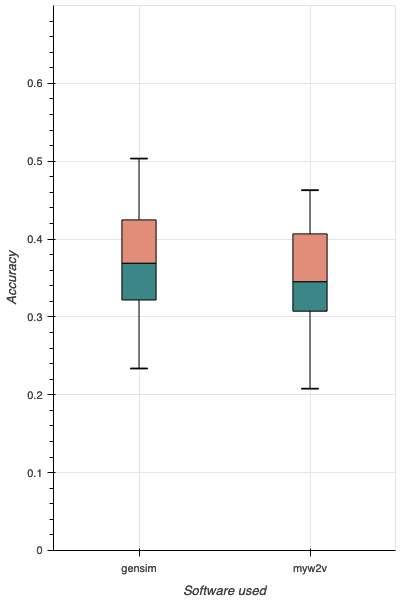
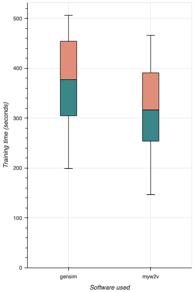

## Myw2v results

For my thesis, I trained a number of word2vec models with gensim, one per year, from the Yle corpus and STT corpus:

* [Yle news article archive (in Finnish)](http://urn.fi/urn:nbn:fi:lb-2017070501) - 2011-2018
* [STT news article archive (in Finnish)](http://urn.fi/urn:nbn:fi:lb-2019041501) - 1992-2018

For more information, see [my master's thesis here](https://helda.helsinki.fi/handle/10138/323724).

After writing myw2v, I also trained myw2v models for each year of material to compare myw2v with gensim. The following picture depicts the results of the word analogy test (Finnish edition - see thesis) on all 35 yearly data sets:

The training times were as follows:

The average training time was roughly 17% lower for myw2v than for gensim. It is interesting that for an English-language corpus (see [myw2v README](../README.md)) the speed advantage of myw2v was noticeably larger.

For the accuracy, myw2v scored, on average, roughly 7% lower than gensim on these corpora - 34.5% vs. 36.9%.

These comparative results are in the same direction as those obtained with the English-language Wikipedia corpus.
